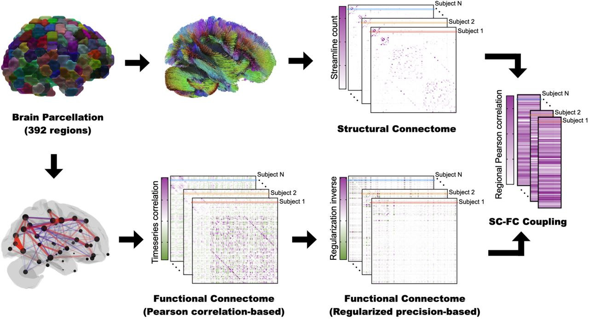

```{r setup, include=FALSE}
knitr::opts_chunk$set(echo = TRUE)
```

Abstract
--------

Hundreds of thousands of people die each year from alcohol and drug related incidents in the United States alone. Drugs and alcohol have ruined families, careers, and lives across the globe, so what makes a person turn to these substances? What effects do they truly have on the human brain? The Human Connectome Project (HCP) is a brain connectivity study that analyzes the structural and functional connectomes in adult brains in an attempt to make comparisons between subject’s brain circuits, genetics, and behavior. Advances in MRI brain scan resolution makes this dataset ideal for studying the relationship between brain connectomes and human traits. This paper studies the effects of substance abuse in multiple forms on brain functional connectivity. Specifically, we apply classification procedures on 1065 subjects from the latest HCP release in 2017 to understand the true effect different substances have on brain function. We consider participants who use hard drugs (Cocaine, Methamphetamine, Opiates, Oxycontin), Marijuana, and alcohol. We first compute the Structural-Functional Coupling Factor for each participant and compare the results across groups. Then, using results from a previously done Tensor Principal Component dimensionality reduction for the structural and functional connectomes and the coupling analysis, we build classification models for hard drug, Marijuana, and alcohol users. We use logistic regression, penalized logistic regression (Ridge, LASSO, Elastic Net), and random forests to classify subjects. Through hypothesis testing, we find that the coupling factor does not change across user groups. Also, we have the best success in predicting over the alcohol use group. We conclude that, despite our models’ lack of sensitivity and specificity, alcohol use seems to have a greater effect on the brain’s functional connectomes than Marijuana or hard drug use. 

Introduction
------------

Substance abuse has become a major issue over the past 25 years. Millions of families across the United States have suffered because of the loss of a loved one due to alcohol or drug related deaths. These substance abusers often get so caught up in their addiction they neglect all other aspects of their life. The impacts and dangers of hard drugs and alcohol are already well known, but what are the true effects these substances have on the brain? The Human Connectome Project (HCP) attempts to answer this question. With modern advances in high resolution MRI brain scans, we may have found a way to quantify a substance's effect on the human brain. Participants in the HCP go through multiple trials of MRIs to extract the brain imaging data necessary to construct the connectomes used in this study. Structural connectome (SC) and functional connectome (FC) matrices are constructed by first rebuilding the brain fibers from the MRI, this process is called tractography. Once the tractography is complete we can utilize a well known brain atlas, for example the Desikan-Killiany atlas, to divide the 3D image into 68 sections, 34 for each hemisphere. From there, we can extract a set of weight matrices to represent the brain’s interconnections. 

The HCP studies the functional and structural connectomes in adult brains as well as various behavioral and genetic traits of the subjects. This combination of rich trait data and advanced brain imaging provides the ideal information for studying the relationship between connectomes and human traits, such as substance abuse. This paper aims to study the effects of certain substances on the functional and structural connectomes in 1065 subjects from the latest HCP release in 2017. Specifically, we will use machine learning methods to classify participants as substance users using their structural and diffusion MRI results. We will assess hard drug use (tested positive for Cocaine, Methamphetamine, Opiates, Oxyontin), Marijuana use, and alcohol use in an attempt to discover which substances have the greatest effect on overall brain function. A Tensor Principal Component dimensionality reductions has been previously applied to the SC and FC matrices. This process greatly reduced the dimension of the full FC and SC matrices from 2278 unique readings to only 60 by approximating the brain tensor network. R code for this analysis can be found [\textcolor{blue}{HERE}](https://github.com/mattymo18/Brain_Analysis). 

Methodology
-----------

**SC-FC Coupling Factor Computation** \
We begin our analysis by computing the Structural-Functional (SC-FC) Coupling factor. SC-FC Coupling is defined as the association between FC and SC, which allows for more sensitive detection of subtle brain alterations than any single imaging modality (Zhang et al., 2011). We believe this information will help us analyze how well a participants brain is functioning. FC data represents correlation in activity between brain regions. These matrices relay information about how well the separate regions of the brain are functioning together. SC data explains the physical connection between regions of the brain. The integration of SC with FC allows the characterization of functional dynamics of the brain in terms of spatial topology (Greicius, Supekar, Menon, & Dougherty, 2009; Honey et al., 2009). The match between SC and FC matrices, denoted by $\rho$, evaluated from the correlation between their vectorized upper triangular parts (Raphel, Augusto et al. 2020). 
$$\rho = corr(|FC^\Delta|, SC^\Delta)$$

The operator $\Delta$ transforms the symmetric FC and SC matrices into their respective vectorized upper triangular entries. An important factor of this computation is that the absolute value of the FC matrix is used. Since $SC_{ij} \ge 0, \forall (i,j)$ the sign of FC values is not meaningful. Below is the workflow for quantifying regional SC-FC coupling. 

```{r, echo=FALSE, out.width="80%", fig.align='center', fig.cap='SC-FC Coupling factor workflow (Zijin, Keith et al. 2020).'}

```

**Logistic Regression** \
After computing the coupling factor, we move onto prediction methods. The first method we will employ is Logistic Regression for binary outcomes. We begin with this method since it is easily interpretable and often a very effective model for predicting binary classes. Logistic regression attempts to model the Log Odds of the response value, in this case the binary indicator for substance abuse, as a linear function of the predictors. The simple logistic regression model is defined as: 
$$L = \beta_0 + \sum_{i=1}^n \beta_ix_i$$ 

where $L$ is the log odds and the $\beta_is$ are the parameters with $\beta_0$ as the intercept. We fit a logistic model on each of the three user groups (hard drugs, Marijuana, alcohol) using the TNPCA data for the FC and SC separately along with the coupling statistic. At this point, we are unsure if the FC and SC is more useful in predicting a substance abuser, so we use the TNPCA results for both and fit separate models on each group. 

We decide to measure Logistic model effectiveness using Area Under the Receiver Operating Characteristic curve, or more simply Area Under Curve (AUC). AUC is calculated by first computing the Receiver Operating Characteristic curve, then measuring the area under this curve. AUC combines the False positive rate (FPR) and the True positive rate (TPR) into a single metric that describes the overall performance of the model. We begin using this method of model evaluation, but will later move on to use F1 score after discovering issues with class imbalances.

**Penalized Regression** \

**Random Forest** \


Results
-------

**SC-FC Coupling Factor** \

**Logistic Regression** \

**Penalized Regression** \

**Random Forest** \

Conclusion
----------

References
----------


```{r, echo=FALSE, out.width="50%"}
# knitr::include_graphics("README_graphics/HR.png")
# knitr::include_graphics("README_graphics/Pitcher.png")
#use later for putting pictures in
```