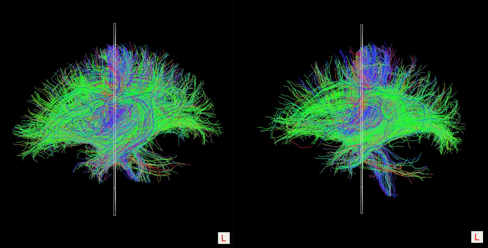

```{r setup, include=FALSE}
knitr::opts_chunk$set(echo = TRUE)
library(tidyverse)
```

Abstract
--------

Hundreds of thousands of people die each year from alcohol and drug related incidents in the United States alone. Drugs and alcohol have ruined families, careers, and lives across the globe, so what makes a person turn to these substances? What effects do they truly have on the human brain? The Human Connectome Project (HCP) is a brain connectivity study that analyzes the structural and functional connectomes in adult brains in an attempt to make comparisons between subject’s brain circuits, genetics, and behavior. Advances in MRI brain scan resolution makes this dataset ideal for studying the relationship between brain connectomes and human traits. This paper studies the effects of substance abuse in multiple forms on brain functional connectivity. Specifically, we apply classification procedures on 1065 subjects from the latest HCP release in 2017 to understand the true effect different substances have on brain function. We consider participants who use hard drugs (Cocaine, Methamphetamine, Opiates, Oxycontin), Marijuana, and alcohol. We first compute the Structural-Functional Coupling Factor for each participant and compare the results across groups. Then, using results from a previously done Tensor Principal Component dimensionality reduction for the structural and functional connectomes and the coupling analysis, we build classification models for hard drug, Marijuana, and alcohol users. We use logistic regression, penalized logistic regression (Ridge, LASSO, Elastic Net), and random forests to classify subjects. Through hypothesis testing, we find that the coupling factor does not change across user groups. Also, we have the best success in predicting over the alcohol use group. We conclude that, despite our models’ lack of sensitivity and specificity, alcohol use seems to have a greater effect on the brain’s functional connectomes than Marijuana or hard drug use. 

Introduction
------------

Substance abuse has become a major issue over the past 25 years. Millions of families across the United States have suffered because of the loss of a loved one due to alcohol or drug related deaths. These substance abusers often get so caught up in their addiction they neglect all other aspects of their life. The impacts and dangers of hard drugs and alcohol are already well known, but what are the true effects these substances have on the brain? The Human Connectome Project (HCP) attempts to answer this question. With modern advances in high resolution MRI brain scans, we may have found a way to quantify a substance's effect on the human brain. Participants in the HCP go through multiple trials of MRIs to extract the brain imaging data necessary to construct the connectomes used in this study. Structural connectome (SC) and functional connectome (FC) matrices are constructed by first rebuilding the brain fibers from the MRI, this process is called tractography. Once the tractography is complete we can utilize a well known brain atlas, for example the Desikan-Killiany atlas, to divide the 3D image into 68 sections, 34 for each hemisphere. From there, we can extract a set of weight matrices to represent the brain’s interconnections. 

The HCP studies the functional and structural connectomes in adult brains as well as various behavioral and genetic traits of the subjects. This combination of rich trait data and advanced brain imaging provides the ideal information for studying the relationship between connectomes and human traits, such as substance abuse. This paper aims to study the effects of certain substances on the functional and structural connectomes in 1065 subjects from the latest HCP release in 2017. Specifically, we will use machine learning methods to classify participants as substance users using their structural and diffusion MRI results. We will assess hard drug use (tested positive for Cocaine, Methamphetamine, Opiates, Oxyontin), Marijuana use, and alcohol use in an attempt to discover which substances have the greatest effect on overall brain function. A Tensor Principal Component dimensionality reductions has been previously applied to the SC and FC matrices. This process greatly reduced the dimension of the full FC and SC matrices from 2278 unique readings to only 60 by approximating the brain tensor network. R code for this analysis can be found [\textcolor{blue}{HERE}](https://github.com/mattymo18/Brain_Analysis). 

Methodology
-----------

**SC-FC Coupling Factor Computation** \
We begin our analysis by computing the Structural-Functional (SC-FC) Coupling factor. SC-FC Coupling is defined as the association between FC and SC, which allows for more sensitive detection of subtle brain alterations than any single imaging modality (Zhang et al., 2011). We believe this information will help us analyze how well a participants brain is functioning. FC data represents correlation in activity between brain regions. These matrices relay information about how well the separate regions of the brain are functioning together. SC data explains the physical connection between regions of the brain. The integration of SC with FC allows the characterization of functional dynamics of the brain in terms of spatial topology (Greicius, Supekar, Menon, & Dougherty, 2009; Honey et al., 2009). The match between SC and FC matrices, denoted by $\rho$, evaluated from the correlation between their vectorized upper triangular parts (Raphel, Augusto et al. 2020). 
$$\rho = corr(|FC^\Delta|, SC^\Delta)$$

The operator $\Delta$ transforms the symmetric FC and SC matrices into their respective vectorized upper triangular entries. An important factor of this computation is that the absolute value of the FC matrix is used. Since $SC_{ij} \ge 0, \forall (i,j)$ the sign of FC values is not meaningful. Below is the workflow for quantifying regional SC-FC coupling. 

```{r, echo=FALSE, out.width="80%", fig.align='center', fig.cap='SC-FC Coupling factor workflow (Zijin, Keith et al. 2020).'}
knitr::include_graphics("images/F1_large.jpg")
```

**Logistic Regression** \
After computing the coupling factor, we move onto prediction methods. The first method we will employ is Logistic Regression for binary outcomes. We begin with this method since it is easily interpretable and often a very effective model for predicting binary classes. Logistic regression attempts to model the Log Odds of the response value, in this case the binary indicator for substance abuse, as a linear function of the predictors. The simple logistic regression model is defined as: 
$$L = \beta_0 + \sum_{i=1}^n \beta_ix_i$$ 

where $L$ is the log odds and the $\beta_is$ are the parameters with $\beta_0$ as the intercept. We fit a logistic model on each of the three user groups (hard drugs, Marijuana, alcohol) using the TNPCA data for the FC and SC separately along with the coupling statistic. At this point, we are unsure if the FC and SC is more useful in predicting a substance abuser, so we use the TNPCA results for both and fit separate models on each group. 

We decide to measure Logistic model effectiveness using Area Under the Receiver Operating Characteristic curve, or more simply Area Under Curve (AUC) and Akaike Information Criterion (AIC). AUC is calculated by first computing the Receiver Operating Characteristic curve, then measuring the area under this curve. AUC combines the False positive rate (FPR) and the True positive rate (TPR) into a single metric that describes the overall performance of the model. AIC is only used here as a preliminary measure to get a sense of which models are performing well. We begin using this method of model evaluation, but will later move on to use F1 score after discovering issues with class imbalances.

**Penalized Regression** \
We continue modeling procedures with three methods of Penalized Logistic Regression (Ridge, LASSO, Elastic Net). Historically, these methods are used when the data is of high dimension. Also, we suspect many of these predictors will likely not be useful in classifying a substance abuser and that is potential for multicollinearity. We fit these models on the TNPCA and coupling factor for FC and SC respectively. 

*Ridge:* Ridge regression is the first method considered. Ridge is a form of multiple regression that add a penalty factor for the $\beta$ estimates. Ridge regression allows for the number of columns to be greater than the number of observations unlike Ordinary Least Squares (OLS). Ridge also shrinks coefficients and controls the tradeoff between fit and magnitude of $\beta{}s$. In OLS, 
$$\hat\beta = (X^tX)^{-1}X^ty$$ 

while in Ridge we have 
$$\hat\beta_{ridge} = (X^tX + \lambda I_p)^{-1}X^ty$$ 

where $I_p$ is the pxp Identity matrix and $\lambda$ is the penalty factor. We use cross validation to find the optimal $\lambda$ that minimizes the error. Ridge regression can also be written in the form of an optimization program: 
$$\min_{\beta_0, \beta} [\sum_{i=1}^N(y_i-\beta_0-x_i^t\beta)^2] \ \ \ \ s.t.\sum_{j=1}^p|\beta_j|_2 \le t$$

Where $|\beta_j|_2$ is the L2 norm of $\beta_j$. This is very similar to the LASSO optimization problem discussed next. 

*LASSO:* LASSO regression is then computed. LASSO is similar to Ridge in that it utilizes a penalty parameter, but rather then shrinking $\beta{}s$ it pushes them to 0. This is useful in this case since we have many predictors and it is likely some of them will not be useful. LASSO will push the insignificant predictors to 0 and leave the others in the model. This works as a variable selection technique. LASSO can be written as an optimization problem rather than a regression problem in the form:
$$\min_{\beta_0, \beta} [\sum_{i=1}^N(y_i-\beta_0-x_i^t\beta)^2] \ \ \ \ s.t.\sum_{j=1}^p|\beta_j|_1 \le t$$

Where $|\beta_j|_1$ is the L1 norm of $\beta_j$. This constraint ensures the $\beta$ estimates will be below a certain threshold. We use cross-validation to find the optimal value for t that minimizes the error. 

*Elastic Net:* Finally, we consider the Elastic Net. The elastic net can be thought of as the intersection between Ridge and Lasso. The Elastic Net combines the L1 and L2 norms and uses two separate penalties to incorporate them both into single expression. The $\hat\beta$ estimates can be calculated with the following expression:
$$\hat\beta = \arg\min_{\beta}[\sum_{i=1}^N(y_i-\beta_0-x_i^t\beta)^2 + \lambda|\beta|_2 + \alpha|\beta|_1]$$

where $\lambda$ is the penalty parameter for the L2 Norm of $\beta$ and $\alpha$ is the penalty parameter for the L1 norm of $\beta$. We used cross validation to find optimal values for $\lambda$ and $\alpha$. 

Each of these three models were trained and tested on independent sets that maintained the initial class distribution for the substance abusers. We fit each of these models on the three substance use groups for a total of 9 models. 

**Random Forest** \
The last modeling technique we decided to use was Random Forest (RF) for classification. RF's utilize many decision trees to complete a classification. Decision trees work by creating partitions that split the features space in a way such that the partition boundary is axis-parallel. The tree continues splitting the feature space until a subsequent split no longer increases the change in purity (or in this case F1 score). A RF is simply a whole group of decision trees that takes the majority vote for how to classify each sample. Each tree is trained on a bootstrapped sample of the original data, using a random subset of all the predictors. As a result, it is oftentimes more desirable to use random forest than a single decision tree, since random forest does not suffer from high variance and can still draw a non-linear decision boundary. 

We decide to change our method of model evaluation here because in previous models we wanted a more general idea of how well the models performed. Using AUC gave us a generalized idea of how the model performed, but F1 score puts an emphasis on the minority class prediction. In our case, we are always trying to predict that a member is in the minority class, so we decided F1 score would be a better indicator of how well we predicted the minority class. Also, we decided to move away from modeling on both SC and FC separately and only used FC for the RF modeling procedure. We make this decision because in the previous modeling procedures we found slightly better results using the TNPCA of the FC matrices instead of from the SC matrices. We believe this is because most participants have similar brain connections regardless of their substance abuse history. We are more interested in the function of the brain rather than the specific connections the brain contains. Finally, we decided to end our analysis of Marijuana use to focus on more devastating substances (Cocaine, Oxycontin, alcohol) with regard to deaths. This decision was made according to the poor results on our previous Marijuana usage models, as well as the revolutionizing social climate around Marijuana use. We found it was most difficult to model for a marijuana, thus we decided there must not be as big of a difference between a Marijuana users brain and a non-user's brain. Furthermore, many states have begun to legalize Marijuana deeming it healthy enough for recreational use.

To combat class imbalance, one common strategy is to over-sample the minority class to obtain a balanced dataset. Simple approaches to over-sampling could be repeating or bootstrapping the minority class samples. A more sophisticated approach of oversampling, Randomly Over Sampling Examples, or ROSE, is used here. Operationally, ROSE creates synthetic samples  by drawing examples from a conditional kernel density estimate of the minority class, as described in Menardi and Torelli (2013).

\pagebreak

Results
-------

**SC-FC Coupling Factor** \
Once we had calculated the SC-FC Coupling Factor the natural next stop was the do a small side analysis on this aspect of the brain. Below are summary tables for the coupling factors across the use different groups as well as T.Test p-values for difference of means between the substance use groups and the control (Non-user) group. 
```{r, echo=FALSE, out.width="80%", fig.align='center'}
Table <- data.frame(
  Substance = c("Control", "Alcohol", "Hard Drug", "Marijuana"), 
           Minimum = c(0.1188, 0.1242, 0.1638, 0.1282), 
  `First Quartile` = c(0.2161, 0.2092, 0.2322, 0.2148), 
            Median = c(0.2391, 0.2359, 0.2459, 0.2384), 
              Mean = c(0.2382, 0.2329, 0.2450, 0.2362), 
  `Third Quartile` = c(0.2621, 0.2609, 0.2679, 0.2611), 
           Maximum = c(0.3233, 0.3028, 0.3080, 0.3226)
)
knitr::kable(Table, caption = "Summary Statistics for User Group Couplings")
```

```{r, echo=FALSE, out.width="80%", fig.align='center'}
Table <- data.frame(
  Substance = c("Alcohol", "Hard Drug", "Marijuana"), 
  `P-Value` = c(0.08, 0.32, 0.39)
)
knitr::kable(Table, caption = "P-Values for T.Test Difference of Means")
```

As you can see above, there does not seem to be a significant difference between the different substance groups and the control groups at .05, but it is close in alcohol. This leads us to believe may be a difference between the alcohol group and the control, but it is very small. Figure 2, shown below, reinforces this result. The histograms clearly overlap and seem to have a similar peak. 

```{r, echo=FALSE, out.width="50%", fig.align='center', fig.cap='Substance User Couplings'}

```

\pagebreak

**Logistic Regression** \
The model performance metrics for the logistic regression using the TNPCA and coupling data for FC and SC are found below. 

```{r, echo=FALSE, out.width="80%", fig.align='center'}
Table <- data.frame(
  Substance = c("Alcohol", "Hard Drug", "Marijuana"),
  AIC = c(804.49, 1042.12, 22.04),
  AUC = c(0.70, 0.69, 0.94)
)
knitr::kable(Table, caption = "Logistic Regression TNPCA FC and Coupling")
```

```{r, echo=FALSE, out.width="80%", fig.align='center'}
Table <- data.frame(
  Substance = c("Alcohol", "Hard Drug", "Marijuana"),
  AIC = c(800.54, 1081.10, 217.56),
  AUC = c(0.70, 0.65, 0.94)
)
knitr::kable(Table, caption = "Logistic Regression TNPCA SC and Coupling")
```

From Table 3 and table 4 we see the Marijuana models are not performing as well as the other two models. There is only a slight reduction in AUC, but a large increase in AIC. This implies the interaction between the TNPCA data and the coupling results explain the disparity between the hard drug users and alcohol users better than the Marijuana users. Also, AUC seems very high in the drug models. We believe this due to the major class imbalance. Figure 3 and Figure 4 below show the AUC curve for alcohol and hard drug users. 

```{r, echo=FALSE, out.width="50%", fig.align='center', fig.cap='AUC Curvev Alcohol'}
knitr::include_graphics("derived_graphics/FC_ROC_Curve_Alc.png")
```

```{r, echo=FALSE, out.width="50%", fig.align='center', fig.cap='AUC Curve Hard Drugs'}
knitr::include_graphics("derived_graphics/FC_ROC_Curve_Drug.png")
```

As you can see, in the hard drug case the plot moves rapidly up. This leads us to believe the model has high recall but low precision. Since there are so few drug users in the set, predicting that every user does not use drugs leads to misleading accuracy. We then move on to penalized regression to see if we can improve on these results. 

\pagebreak

**Penalized Regression** \
Penalized Logistic model metrics are shown in Tables 5,6 and 7 below. For each substance use group, we trained Ridge, LASSO, and Elastic Net models. We continue to use AUC as the performance metric, but we also include pure accuracy to show the disparity between the metrics. Due to the class imbalance, accuracy is a flawed metric. In every case the model chooses the majority class as each prediction. 

```{r, echo=FALSE, out.width="60%", fig.align='center'}
Table <- data.frame(
  Model = c("Ridge", "LASSO", "Elastic Net"),
  AUC = c(0.46, 0.50, 0.47),
  Accuracy = c(0.80, 0.80, 0.80)
)
knitr::kable(Table, caption = "Performance Metrics Penalized Model Alcohol Users")
```

```{r, echo=FALSE, out.width="60%", fig.align='center'}
Table <- data.frame(
  Model = c("Ridge", "LASSO", "Elastic Net"),
  AUC = c(0.52, 0.48, 0.53),
  Accuracy = c(0.98, 0.98, 0.98)
)
knitr::kable(Table, caption = "Performance Metrics Penalized Model Hard Drug Users")
```

```{r, echo=FALSE, out.width="60%", fig.align='center'}
Table <- data.frame(
  Model = c("Ridge", "LASSO", "Elastic Net"),
  AUC = c(0.56, 0.50, 0.50),
  Accuracy = c(0.57, 0.57, 0.96)
)
knitr::kable(Table, caption = "Performance Metrics Penalized Model Marijuana Users")
```

\pagebreak

The extremely high accuracy in the drug group lead us to find the class imbalance was more skewed then we initial thought. This accuracy is, essentially, the No-Information prediction error. If we choose the majority class each time this is our accuracy in each model for each user group. This is not a meaningful result. When we attempted the under-sampling method, the models did not converge and many of the coefficients became 0 due to a singularity issue. We concluded that under sampling is not useful for this data, and does not help us predict substance users. In the next section we will discuss the Random Forest results with ROSE sampling. 

**Random Forest** \
As described in the *Methodology* section a 10-fold cross validated random forest is fit on the drug and alcohol user groups separately. For each fold, 15 randomly selected 'mtry' parameters are chosen. These control the number of predictors to use in each tree. The optimal 'mtry' value is used in the final model. Also, we complete one test with and one test without ROSE sampling. Table 8 displays the results for the Random Forest analysis. 

```{r, echo=FALSE, out.width="60%", fig.align='center'}
Table <- data.frame(
  Model = c("Random Forest (Without Rose)", "Random Forest (ROSE)"),
  Alcohol = c(0.07, 0.32), 
  `Hard Drugs` = c(0, 0.07)
)
knitr::kable(Table, caption = "F1 Score Random Forest Analysis")
```

As you can see, ROSE sampling made a substantial difference in the models predictive capability. Still, the model has quite a low F1 score meaning it my have high recall but low precision. The models are able to identify alcohol users, but now that the data is balanced with ROSE, there are too many false positives. 

**Heatmaps and Tractography** \
In addition to our modeling results, we decided to seek out the tractography of representative subjects in the analysis. We found an an alcohol user, a hard drug user, and a control and built plots to compare the three groups. We used Trackvis software to open each subjects left side of the brain. Different colors represent different values for brain function. Figure 5 shows the heatmaps for each subject corresponding to their FC matrix. Figures 6 and 7 show the trachtography between a substance abuser and the conrol. In each case the substance user is on the left and the control on the right. 

```{r, echo=FALSE, out.width="50%", fig.align='center', fig.cap='FC Spectral Heatmaps'}
knitr::include_graphics("derived_graphics/FC_Heatmaps.png")
```

```{r, echo=FALSE, fig.asp=.05, fig.align='center', fig.cap='Alcohol User Vs. Control'}

```

```{r, echo=FALSE, fig.asp=.05, fig.align='center', fig.cap='Drug User Vs. Control'}

```

\pagebreak

In each figure above, you can clearly see a difference between the three groups. Alcohol seems to have the greatest difference according to the heatmap. There are slight differences in the trachtography in the top and bottom of the brains. In the drug user we see a sharp red group of lines towards the bottom of the brain that is a major difference between the plots. Similarly, in the alcohol plot we see a much larger bundle towards the bottom left that does not appear in the control brain. 

Conclusion & Future Research
----------------------------

**Conclusion** \
Despite trying multiple different types of modeling we were unable to achieve a strong stable way to accurately classify an alcohol or drug user. We saw slight improvements when using a comprehensive method like Random Forest, but still the F1 score is not good enough. ROSE sampling seemed to greatly help the models performance and seems reasonable to use in this case with large class imbalances. We have listed a few reasons we believe we were unsuccessful in accurately predicting substance groups below. 

1. Age was not considered during modeling. Age could have a major impact on this analysis since certain substance users could have been using for a very long time or a very short time depending on their age. 
2. Gender is not considered. Gender plays an important role in brain size and thus can have an affect on brain function. Alcohol abuse could lead to even more drastic differences in females rather than males. 
3. Our threshold for using alcohol and drugs only took into account the past years data. We do not know how long a subject has been using a substance. These drugs can take time to show their true affects and a single year may not be long enough. 

We can conclude that we had the best results when applying our models to the alcohol user group. We believe this to mean there is a statistical difference in the alcohol users brain function when compared to a non-user. We believe that due to alcohols depressive nature someone who is using alcohol over a long period of time will begin to see diminished brain function. 

**Future Research** \
Future work should include more advanced classification techniques such as XGBoost, Gradient Boosting Machines, and Neural Networks. These modeling methods sometimes lack interpretability, but can usually classify with high precision. Also, adding gender and age statistics to the predictors could add to prediction ability. Furthermore, quantifying longevity of substance use could be key to analyzing the correct subjects brains. We need data from people that have been long time substance abusers so we can see the true effects of long term use. 


CRediT Authorship Contribution Statement
----------------------------------------
1. Christina (Ke) Cai: Visualization (3d plot), Modeling (Random Forest)
2. Jimin Choi: Data Cleaning, Modeling (Logisitc Regression), Coupling Factor Analysis
3. Matt Johnson: Data Cleaning, Modeling (Penalized Models), Visualization, Git Management, Latex Compilation

\pagebreak

References
----------
1. Aberrant structural–functional coupling in adult cannabis users Dae-Jin Kim1 | Ashley M. Schnakenberg Martin1 | Yong-Wook Shin2 | Hang Joon Jo3 | Hu Cheng1,4 | Sharlene D. Newman1,4 | Olaf Sporns1,5 | William P. Hetrick1 | Eli Calkins1 | Brian F. O'Donnell1.

2. Development of structure–function coupling in human brain networks during youth”-Graham L. Baum, Zaixu Cui, David R. Roalf, Rastko Ciric, Richard F. Betzel, Bart Larsen.

3. Individual structural features constrain the mouse functional connectome Francesca Melozzia,1, Eyal Bergmannb,1, Julie A. Harrisc , Itamar Kahnb,2, Viktor Jirsaa,2,3, and Christophe Bernarda,2,3.

4. Raphael Liégeois, Augusto Santos, Vincenzo Matta, Dimitri Van De Ville, Ali H. Sayed; Revisiting correlation-based functional connectivity and its relationship with structural connectivity. Network Neuroscience 2020; 4 (4): 1235–1251.

5. Regional structural-functional connectome coupling 2 is heritable and associated with age, sex and 3 cognition in adults Zijin Gu1 , Keith Wakefield Jamison2 , Mert Rory Sabuncu1,2, and Amy Kuceyeski2. 

6. Zhang, Z. , Liao, W. , Chen, H. , Mantini, D. , Ding, J. R. , Xu, Q. , … Lu, G. (2011). Altered functional‐structural coupling of large‐scale brain networks in idiopathic generalized epilepsy. Brain, 134, 2912–2928.